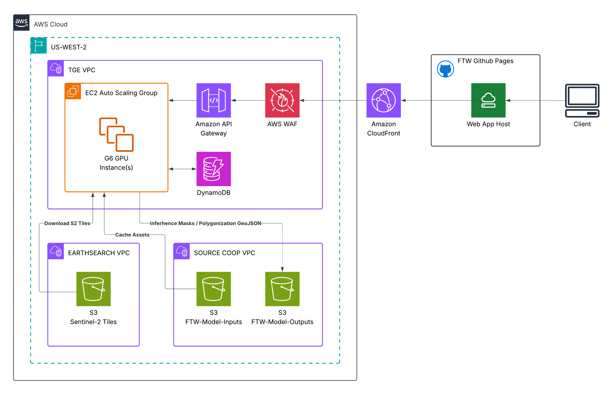

# ftw-api-deployment

Terraform infrastructure as code for FTW API deployment on AWS. Creates a complete FastAPI application infrastructure with GPU testing capabilities.

## Prerequisites

- AWS CLI v2 installed and configured
- Terraform >= 1.10 installed
- AWS account with appropriate permissions

## Infrastructure Overview



This Terraform configuration creates:

- **VPC**: DNS support, hostnames enabled, public/private subnets across 2 AZs
- **Networking**: Internet Gateway, NAT Gateway(s), route tables
- **Compute**: Auto Scaling Group with EC2 instances for FastAPI application
- **Load Balancing**: Internal Application Load Balancer with HTTP
- **API Gateway**: HTTP API with CORS configuration and custom domain support
- **CDN**: CloudFront distribution for caching and global distribution
- **Security**: WAF with rate limiting, IAM roles, security groups, SSL certificates
- **Storage**: S3 bucket for model outputs with VPC endpoint
- **Access**: SSM Session Manager for secure instance access

### Network CIDR Layout

With the default VPC CIDR block of `10.0.0.0/16`:

| Subnet | CIDR Block | Availability Zone | Type |
|--------|------------|-------------------|------|
| Public AZ1 | `10.0.0.0/24` | us-east-1a | Public |
| Public AZ2 | `10.0.1.0/24` | us-east-1b | Public |
| Private AZ1 | `10.0.2.0/24` | us-east-1a | Private |
| Private AZ2 | `10.0.3.0/24` | us-east-1b | Private |

## Project Structure

```
.
├── environments/
│   └── dev/
│       ├── main.tf           # Main configuration
│       ├── variables.tf      # Variable definitions
│       └── terraform.tfvars  # Environment-specific values
├── modules/
│   ├── vpc/                  # VPC and networking
│   ├── ec2/                  # Auto Scaling Group and EC2
│   ├── alb/                  # Application Load Balancer
│   ├── api-gateway/          # API Gateway HTTP API
│   ├── cloudfront/           # CloudFront CDN distribution
│   ├── waf/                  # Web Application Firewall
│   ├── certificate-manager/  # SSL certificates and Route53
│   ├── s3/                   # S3 storage and VPC endpoint
│   ├── iam/                  # IAM roles and policies
│   └── security-groups/      # Security group rules
└── bootstrap/
    └── bootstrap-s3.sh       # S3 backend setup script

```

## Getting Started

### One-Time Setup (First User Only)

1. Clone this repository
2. Configure AWS credentials: `aws configure`
3. Create the S3 backend: `./bootstrap/bootstrap-s3.sh`

### Deploy Infrastructure

1. Navigate to environment: `cd environments/dev`
2. Edit `terraform.tfvars` with your specific values
3. Initialize Terraform: `terraform init`
4. Review the plan: `terraform plan`
5. Apply the configuration: `terraform apply`

## Configuration

### Key Variables in terraform.tfvars

```hcl
# Basic Configuration
region             = "us-east-1"
vpc_cidr_block     = "10.0.0.0/16"
environment        = "dev"
single_nat_gateway = true

# EC2 Configuration
instance_type = "t3.micro"     # Use "g4dn.xlarge" for GPU testing
key_pair_name = ""             # Leave empty for SSM-only access

# Auto Scaling Group Configuration
asg_config = {
  min_size                  = 1
  max_size                  = 1    # Set to 3+ to enable scaling
  desired_capacity          = 1
  health_check_type         = "EC2"
  health_check_grace_period = 300
}
```

### GPU Testing Configuration

For GPU-based inference testing, update your `terraform.tfvars`:

```hcl
instance_type = "g4dn.xlarge"  # or other GPU instance types
```

## Access and Management

### Connecting to EC2 Instances

Use AWS Systems Manager Session Manager for secure access:

```bash
# List running instances
aws ec2 describe-instances --filters "Name=tag:Environment,Values=dev" --query 'Reservations[].Instances[?State.Name==`running`].[InstanceId,Tags[?Key==`Name`].Value|[0]]' --output table

# Connect to instance
aws ssm start-session --target i-1234567890abcdef0
```

### Enabling Auto Scaling

To enable auto scaling for load testing:

```hcl
asg_config = {
  min_size                  = 1
  max_size                  = 5
  desired_capacity          = 2
  health_check_type         = "ELB"  # Use ALB health checks
  health_check_grace_period = 600
}
```

## Cost Optimization

- **Development**: Use `single_nat_gateway = true` and `t3.micro` instances
- **GPU Testing**: Use `g4dn.xlarge` or similar GPU instances as needed
- **Production**: Set `single_nat_gateway = false` for high availability

## Outputs

Key outputs after deployment:

- `vpc_id` - VPC identifier
- `api_url` - Primary API URL (custom domain or CloudFront)
- `api_gateway_stage_invoke_url` - Direct API Gateway endpoint
- `route53_name_servers` - DNS name servers for custom domain
- `ssl_certificate_arn` - SSL certificate ARN
- `autoscaling_group_name` - ASG name for management
- `launch_template_id` - Launch template identifier
- `ami_id` - AMI used by EC2 instances

## Clean Up

To destroy the infrastructure:

```bash
cd environments/dev
terraform destroy
```